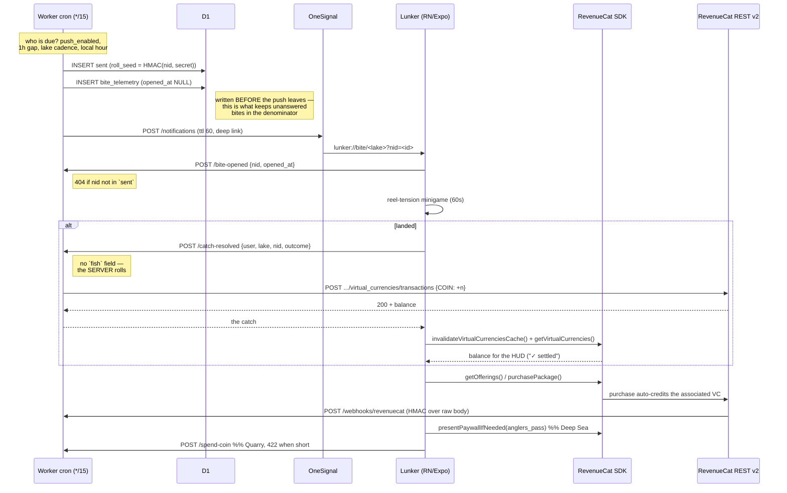

# Architecture — as built

Written from the shipped code, not from the design doc. Every route, table and
SDK method below has a file and line you can open. Where the original design
and the build disagreed, the build won and the disagreement is recorded at the
bottom.

## Stack

| Layer | Choice | Where |
|---|---|---|
| Client | React Native + Expo, Android only, portrait-locked | [`app/`](app/) |
| Purchases | `react-native-purchases@^10.8.1` + `react-native-purchases-ui` | [`app/src/lib/purchases.ts`](app/src/lib/purchases.ts) |
| Push / Journeys | `react-native-onesignal@^5.2.9` | [`app/src/lib/onesignal.ts`](app/src/lib/onesignal.ts) |
| Backend | One Cloudflare Worker + D1. The only backend. | [`worker/`](worker/) |
| Shared logic | Plain ESM imported by the app, the Worker and the CLI | [`shared/`](shared/) |

`shared/` exists so that the killer number, the fish roll and the minigame rules
have exactly one implementation each. `shared/bench.js` in particular is
imported by both `GET /verify` and `scripts/lunker-verify.mjs bench`, which is
what makes the live page and the published figure provably the same computation
rather than two that happen to agree.

## Data flow

## Routes

Seven that carry behaviour, plus three trivial GETs (`/`, `/index.html`, and
`/health`) served by the same router. `/dev/cast` returns 404 unless
`DEV_CAST_ENABLED=1`, which it is not in production.

| Route | Purpose | File |
|---|---|---|
| `POST /catch-resolved` | Client posts that it won. Server rolls the fish from `sent.roll_seed`, grants COIN, returns the catch. Idempotent on `catch:<nid>`. | [`catch-resolved.ts`](worker/src/routes/catch-resolved.ts) |
| `POST /spend-coin` | Atomic COIN debit for a coin-gated lake. 422 is a first-class answer, surfaced as "1,200 COIN — you have 840". | [`spend-coin.ts`](worker/src/routes/spend-coin.ts) |
| `POST /bite-opened` | Telemetry. **404s any `notification_id` not in the `sent` log** — the validity gate under the killer number. | [`bite-opened.ts`](worker/src/routes/bite-opened.ts) |
| `POST /webhooks/revenuecat` | HMAC-SHA256 over raw body. Appends to `purchase_events`. Idempotent on `event_id`. | [`revenuecat-webhook.ts`](worker/src/routes/revenuecat-webhook.ts) |
| `POST /player/sync` | Targeting state: current lake, unlocked lakes, real push permission, tz offset. | [`player-sync.ts`](worker/src/routes/player-sync.ts) |
| `GET /verify` | Read-only, anonymized, aggregate. Runs `computeBench` from `shared/`. | [`verify.ts`](worker/src/routes/verify.ts) |
| `POST /dev/cast` | Recording only. Triggers the bite *timing*; the *roll* stays live. | [`dev-cast.ts`](worker/src/routes/dev-cast.ts) |

Plus a `scheduled` cron handler (not a route) that dispatches bites, in
[`worker/src/index.ts`](worker/src/index.ts).

## Schema

Five tables — [`worker/migrations/0001_init.sql`](worker/migrations/0001_init.sql).
Each is read by either `/verify` or `bench`; there is no table that exists only
to exist.

| Table | Holds | The load-bearing detail |
|---|---|---|
| `sent` | every bite we sent | `roll_seed` is written *before* the push, which is what lets `/catch-resolved` take no `fish` field |
| `bite_telemetry` | one row per bite, `opened_at` NULL until answered | inserted at **send** time, so ignoring a bite counts against us |
| `purchase_events` | HMAC-verified purchases | `event_id` PK makes webhook retries idempotent for free |
| `vc_transactions` | mirror of every COIN movement | RevenueCat is authoritative; this exists so `/verify` renders without an API round-trip |
| `players` | targeting state | balances and push tokens deliberately stay upstream |

**Not stored anywhere:** device tokens (OneSignal holds those) and COIN balances
(RevenueCat holds those). Caching a balance locally would create a second source
of truth for the exact number the server-settled claim rests on.

## RevenueCat surface

Ten call sites, all in [`app/src/lib/purchases.ts`](app/src/lib/purchases.ts)
and [`worker/src/lib/revenuecat.ts`](worker/src/lib/revenuecat.ts):

1. `Purchases.configure({ apiKey, appUserID })` — app launch
2. `Purchases.logIn(appUserId)` — same id as OneSignal's `external_id`
3. `Purchases.getOfferings()` → `current.availablePackages` — the Tackle Shop
4. `Purchases.purchasePackage(pkg)` — coin packs and the Pass
5. `Purchases.getVirtualCurrencies()` → `.all.COIN.balance` — the HUD
6. `Purchases.invalidateVirtualCurrenciesCache()` — before every post-mutation read
7. `RevenueCatUI.presentPaywallIfNeeded({ requiredEntitlementIdentifier })` — Deep Sea
8. `customerInfo.entitlements.active['anglers_pass']` — the gate check
9. `Purchases.restorePurchases()` — reinstall continuity
10. `POST /v2/projects/{p}/customers/{c}/virtual_currencies/transactions` — server-side grant and spend

Plus the HMAC-verified webhook. **Remove RevenueCat and there is no COIN, no
Pass and no lake economy.**

## OneSignal surface

1. `OneSignal.initialize(appId)` + `OneSignal.login(externalId)` — the identity spine
2. In-app message **permission prime**, then the native prompt — after the first landed catch
3. `Notifications.requestPermission` / `hasPermission` — reported to the Worker verbatim
4. `Notifications.addEventListener('click')` — the deep link into the minigame
5. `User.addTags` — `current_lake`, `streak_days`, `unlocked_count`, `rare_count`; what the Journeys branch on
6. Server-side `POST /notifications` and custom events — [`worker/src/lib/onesignal.ts`](worker/src/lib/onesignal.ts)
7. **RevenueCat → OneSignal native integration** (dashboard) forwarding
   `initial_purchase` / `trial_started` / `expiration` so Journeys branch on real
   purchase state

### Notification types — what is in code vs what is dashboard config

Stated separately because only one of the four is built in this repo, and a
table that blurred the two would be the kind of claim this document exists to
prevent.

| Type | Status |
|---|---|
| **Bite alert** — the mechanic | **In code.** `worker/src/lib/bite.ts` → `OneSignalClient.sendBite`, dispatched by the cron handler. |
| **Tide reminder** — streak-preserving | **Designed, not built.** Requires a Journey plus suppression-if-a-bite-was-answered-today; neither exists in this repo. |
| **Milestone catch** | **Half built.** The entry event `rare_landed` is fired server-side from `routes/catch-resolved.ts`; the Journey that consumes it is dashboard config and is not yet created. |
| **Lapsed-angler win-back** | **Designed, not built.** Depends on the RevenueCat → OneSignal integration below. |

Item 7 above (the RevenueCat → OneSignal native integration) is likewise
**dashboard configuration, not code**, and is not yet enabled.

## Where the build disagreed with the design

Recorded rather than quietly reconciled.

**`virtualCurrencies()` is not a method.** The design named it that way
throughout. The real API is `getVirtualCurrencies()`, and it does not exist
below `react-native-purchases@10` — the originally pinned `^8.11.0` has no
virtual-currency surface at all. Found by reading the installed `.d.ts`.

**Four tables and five routes could not send a bite.** The roll design requires
`sent.roll_seed` to exist before the push leaves, and no OneSignal Journey can
write to D1. Nothing could answer "who is due a bite" either. Added `players`,
`POST /player/sync` and the cron dispatcher.

**Bite cadence is fixed per-lake day/night weighting.** "Weather and moon phase"
appeared in early drafts; no weather source exists anywhere in this stack, so it
was cut rather than faked.
