<div align="center">



# Lunker

**The fish bite while your phone is in your pocket.**



[](⟦FILL:PLAY_URL⟧)
[](⟦FILL:GALAXY_URL⟧)
[](⟦FILL:VIDEO_URL⟧)
[](https://lunker.edycu.workers.dev/verify)
[](https://revenuecat-shipaton-2026.devpost.com/)

<br/>


**219 tests** · built for RevenueCat Shipaton 2026 — *Keep Them Coming Back* and *Best Game*

[](https://github.com/edycutjong/lunker/actions/workflows/ci.yml)
[](https://github.com/edycutjong/lunker/actions/workflows/codeql.yml)
[](https://github.com/edycutjong/lunker/actions/workflows/security.yml)
[](LICENSE)

</div>

---

## 💡 The Problem & Solution

A push notification arrives while the app is closed:

```
🎣  Lunker
    Your rod is twitching at Willow Lake
    60s before it escapes.
```

You have sixty seconds. Tapping it opens **directly into the reel-tension
minigame** — not a home screen — with the clock already running. Hold a needle
inside a moving green zone for six seconds and the fish is yours. Miss it and
it's gone.

**The push is not a reminder to play. It is the play.**

Every mobile game bolts on "come back for your daily reward!" and every player
mutes it within a week, because the notification carries no stakes. Lunker's
notification *is* an expiring skill window. Delete OneSignal and there is no
bite, so there is no game — not a degraded game, no game.

## 🏗️ Architecture & Tech Stack

The loop, in the order the system executes it:

| | |
|---|---|
| **A bite arrives** | The Worker's cron dispatcher picks the moment — lake, local hour, one an hour at most, never while you're asleep, capped per lake per day. It writes the roll seed to D1, *then* sends via OneSignal REST. A Journey cannot own this step: the seed must exist before the push leaves. |
| **You reel it in** | Deep link lands in the minigame. 60-second countdown, one thumb, haptic ticks on every zone crossing. |
| **The coin is settled** | The server rolls the fish against a committed weight table and credits COIN through RevenueCat's Virtual Currency API. |
| **You spend it** | Quarry Pool costs 1,200 COIN (atomic server-side debit). Deep Sea needs the Angler's Pass entitlement (RevenueCat paywall). |

| Layer | Technology |
|---|---|
| **Mobile client** | React Native 0.79 on Expo 53, TypeScript, React Navigation 7 — `app/` |
| **Backend** | Cloudflare Workers — 7 routes plus a cron dispatcher, Wrangler 4 — `worker/src/` |
| **Database** | Cloudflare D1 — 5 tables, one migration: `worker/migrations/0001_init.sql` |
| **Monetization** | RevenueCat — `react-native-purchases` v10 in the client, REST v2 Virtual Currency server-side |
| **Messaging** | OneSignal — `react-native-onesignal` v5 in the client, REST push from the cron dispatcher |
| **Shared logic** | Plain ESM imported by both sides — `shared/{bench,content,roll,tension}.js` |
| **Tests** | Vitest 3 against real SQLite via `node:sqlite` |

The system as built, route by route and table by table:
[**ARCHITECTURE.md**](ARCHITECTURE.md).

## 🏆 Sponsor Integration — why the economy is worth believing

Three properties, each of which cost something to build and each of which a
judge can check:

**The client never names its own catch.** `POST /catch-resolved` accepts
`{app_user_id, lake_id, notification_id, outcome}` — and no `fish` field. The
server rolls against the lake's committed table using a seed derived from
`HMAC-SHA256(notification_id, ROLL_SERVER_SECRET)`, which is written to the
`sent` table *before the push leaves*. A modified APK that claims a Legendary
gets whatever the roll says it got.
→ [`worker/src/routes/catch-resolved.ts`](worker/src/routes/catch-resolved.ts)

**The client never moves its own balance.** There is no local increment
anywhere in the app. Every grant and spend is a RevenueCat REST v2 virtual
currency transaction made server-side with the secret key, and the HUD is a
re-read after `invalidateVirtualCurrenciesCache()`. The little "✓ settled" tick
next to the balance is the visible surface of that.
→ [`app/src/lib/purchases.ts`](app/src/lib/purchases.ts)

**Purchases are recorded from a source that isn't the client.** The
HMAC-verified RevenueCat webhook is the only writer of `purchase_events`, which
is the table `/verify` reads from. Signature checked over the raw body bytes,
`event_id` as the primary key so retries are idempotent for free.
→ [`worker/src/routes/revenuecat-webhook.ts`](worker/src/routes/revenuecat-webhook.ts)

## 📊 Engineering Rigor — the one number

> **⟦FILL:ANSWERED_PCT⟧% of bite pushes were answered within 60 seconds of
> being sent** — ⟦FILL:BITE_N⟧ bites across ⟦FILL:TESTER_N⟧ testers.
> p50 ⟦FILL:P50⟧ · p95 ⟦FILL:P95⟧.

Reproduce it yourself against the live ledger:

```sh
node scripts/lunker-verify.mjs bench --source remote --url https://lunker.edycu.workers.dev
```

Four things about that number are deliberate, and all four make it *worse*:

1. **The window is measured from send, not from open.** Anchoring at open would
   make it ~100% by construction and would falsify the claim that the push is
   the timer. Android Doze and OEM delivery delay show up in the p50/p95 spread
   instead of being defined away.
2. **Unanswered bites stay in the denominator.** The telemetry row is written at
   *send* time with a null open, so ignoring a bite counts against us. Dropping
   those rows would turn 43.6% into 63.0% on our own fixture — asserted as a
   test, not as a claim.
3. **Fabricated pings are rejected.** `POST /bite-opened` 404s any
   `notification_id` not in the `sent` log. Without that gate, anyone with the
   URL could inflate the one number we lead with.
4. **Clock skew is flagged, never clamped.** A device clock behind the server
   produces a negative latency; clamping it to zero would silently move the row
   into the numerator.

Full method and the reproduce steps: [**DEMO.md**](DEMO.md). Architecture as
built: [**ARCHITECTURE.md**](ARCHITECTURE.md).

## 🛡 The harness

Four secrets back this project — the RevenueCat secret key, the webhook HMAC
secret, the OneSignal REST key, and `ROLL_SERVER_SECRET`, which derives every
catch's roll seed. The first can move money; the last lets a player compute their
fish before opening the push. None is in this repository, and the pipeline is
built around keeping it that way.

| Layer | Tool | Gate |
|---|---|---|
| Format | Prettier | hard — `npm run format:check` |
| Lint | ESLint 9, one flat config across the Worker, the RN app and shared ESM | hard — `npm run lint` |
| Types | `tsc --noEmit` on two independent tsconfigs (Workers types, React Native types) | hard, as a matrix |
| Tests | Vitest, 219 across 10 files, on Node 22 **and** 24 | hard |
| Determinism | content seed + telemetry fixture byte-compared; bench output asserted literally | hard |
| Secrets | gitleaks over the **full git history** and the working tree, with rules for all four secrets | hard |
| SAST | CodeQL `javascript-typescript`, `security-and-quality` | hard |
| Dependencies | `npm audit` across all three manifests · Dependabot, grouped, no majors | hard |
| Readiness | `npm run readiness` — fails while any unfilled placeholder survives | advisory in CI, **required before submission** |

Two of those are worth a sentence each, because they are the ones that are
usually decoration:

**The secret scan runs with `fetch-depth: 0`.** This repo is private during the
build and public at submission, and the whole history goes public with it. A key
removed in a later commit is still a key that ships, so scanning the tip proves
nothing. `.gitleaks.toml` carries rules for `ROLL_SERVER_SECRET` specifically —
GitHub's own scanner knows `sk_`-shaped provider keys but has never heard of that
one, and it is the leak with no recovery.

**The Node matrix is 22 and 24, and 20 is deliberately absent.** The route tests
run against real SQLite via `node:sqlite`, which does not exist before 22.5 — so
20 is not a supported floor rather than an untested one. `node:sqlite` is still
experimental, which is exactly why both supported majors run.

Security claims and the test that pins each one:
[**.github/SECURITY.md**](.github/SECURITY.md). Contributing:
[**.github/CONTRIBUTING.md**](.github/CONTRIBUTING.md).

## 🚀 Getting Started

### Prerequisites

Node **22.5+** — the tests run the real migration against `node:sqlite`.

### Installation

```sh
npm install && npm test          # 219 tests
npm run seed                     # deterministic content seed
npm run bench                    # the killer-number computation, on fixture data

npm run ci                       # format + lint + tests, what CI runs
npm run typecheck                # tsc --noEmit for the Worker AND the app
npm run audit                    # dependency CVEs at high+
npm run secrets                  # gitleaks over the history (needs gitleaks installed)
npm run readiness                # fails while any unfilled placeholder survives

cd worker && npm install
npx wrangler d1 migrations apply lunker --local
npx wrangler dev                 # / is the landing page, /verify is the ledger

cd app && npm install --legacy-peer-deps
npx expo run:android
```

Secrets are never in this repo. The Worker needs `REVENUECAT_SECRET_KEY`,
`REVENUECAT_WEBHOOK_SECRET`, `ONESIGNAL_REST_API_KEY` and `ROLL_SERVER_SECRET`
via `wrangler secret put`. Every key, where to get it and which of the three
places it belongs in: [`.env.example`](.env.example).

## 🧪 Testing & CI

**219 tests**, `npm test`. The ones that matter:

- **The bench arithmetic**, against a fixture whose right answer (17/39 = 43.6%,
  p50 9,000, p95 104,000) was computed by hand before the code existed. Each of
  the four anomaly cases is paired with a test asserting *the bias it prevents*.
- **Route contracts against real SQLite** running the real migration — not a
  mock, because a mock would happily agree with a bug in an `ON CONFLICT` clause.
  A client-supplied `fish`/`rarity`/`coins` is asserted to be ignored; a replayed
  catch is asserted to call RevenueCat exactly once.
- **The minigame is actually playable**: a competent policy lands the fish, no
  input escapes, and holding the whole time also escapes. Frame-rate independent
  at 30fps and 120fps.
- **Push copy fits Android's ~65-char pre-ellipsis budget**, so "60s before it
  escapes" is readable without expanding the notification.

## 🙅 What we deliberately did *not* build

Documented because the refusals are decisions, not gaps:

- **No second minigame.** One mechanic done properly beats two done adequately.
- **No iOS build.** Android only — the scope cutline held.
- **Not entering Best App for Galaxy**, despite publishing there. That award puts
  20% of its score on foldable support and Samsung-specific optimization, which
  we are not building. We publish on Galaxy Store for eligibility and reach.
- **No RevenueCat Ads, Web Billing, Experiments, Targeting or Customer Center.**
  All real SDK surfaces, none of them used here, so none of them is claimed.
- **No offline verification harness.** The judged capability *is* a network
  round-trip — a push delivered by OneSignal, a currency grant settled by
  RevenueCat. A harness that made it pass offline would be testing something we
  do not ship.
- **No Playwright, no Lighthouse.** There is no web app to drive. The only HTTP
  surfaces are the Worker's landing page and `/verify`, and both are already
  asserted in `tests/routes.test.js` against real SQLite running the real
  migration. A browser runner here would be a green checkmark measuring nothing.
- **No type-aware ESLint rules.** `tsc --noEmit` already runs against both
  tsconfigs and is the authoritative type gate. A third type graph over the same
  files would produce disagreements that are config bugs, not code bugs.

## 📝 What we got wrong

**2026-09-01 — the permission prime didn't prime.** The in-app message was
triggered and the native Android prompt was fired on the very next line, so both
appeared at once. That is two prompts simultaneously, not priming, and it spent
the one unrecoverable ask every time — while a comment four lines up claimed the
native prompt came from the message's click handler. It didn't. It does now
(`actionId: prime_accept`), with a 4-second never-displayed fallback so an
unauthored message can't mean nobody is ever asked. The lesson isn't the bug,
it's that the comment describing the correct design sat directly above code
doing something else, and read as evidence the design had shipped.

**2026-09-01 — a RevenueCat failure silently deleted the game.** The boot
sequence configured RevenueCat, awaited `logIn`, and *then* initialised
OneSignal — all in one effect with no `.catch()`. Any RevenueCat rejection (an
outage, an unset key, a cold launch with no network) aborted the effect before
the OneSignal line, so that player never received another bite. Push was
downstream of billing, which is exactly backwards for a game whose premise is
push. OneSignal now initialises first and every RevenueCat boot call is guarded
individually. Both defects are pinned by
[`tests/sdk-init.test.js`](tests/sdk-init.test.js), named for the defect each one
catches.

**2026-08-30 — `virtualCurrencies()` does not exist.** Our own architecture doc
named the method that way for a week. The real API is
`Purchases.getVirtualCurrencies()`, and it does not exist at all below
`react-native-purchases@10`. We had pinned `^8.11.0`, which has no
virtual-currency surface whatsoever — the entire economy was specified against a
method signature nobody had run. Caught by reading the installed `.d.ts` instead
of the spec. Fixed by pinning `^10.8.1` and verifying against the shipped types.

**2026-08-30 — the four-table schema could not send a bite.** The architecture
specified `sent`, `bite_telemetry`, `purchase_events`, `vc_transactions` and
exactly five routes. Nothing in that set could answer "which players are due a
bite", and no OneSignal Journey can write `sent.roll_seed` to D1 before a push
leaves — which the roll design requires. Added a `players` table, a
`POST /player/sync` route and a cron dispatcher, and updated the architecture
rather than shipping a doc that described a system that could not run.

**2026-08-30 — `streak_days` was a number nothing incremented.** Four documents
claimed OneSignal Journeys branched on a streak. The column existed, the tag was
sent, and its value was permanently `0` — a phantom integration surface dressed
as depth. Now computed server-side from the player's own local calendar days, in
[`worker/src/lib/streak.ts`](worker/src/lib/streak.ts), with the client's
declared value explicitly ignored.

**2026-08-30 — a reinstall could hide a lake you had paid for.** The album and
the unlocked-lake set lived only in React state, so a relaunch booted with just
the free lakes and pushed *that* to the server, overwriting its record. No money
was lost (the spend is idempotent on its key), but a player who bought Quarry
Pool saw it locked and priced at 1,200 COIN again. Both are now persisted
locally, and `/player/sync` merges rather than replaces.

[**FEEDBACK.md**](FEEDBACK.md) — DX friction we hit in the sponsor SDKs.

## 📄 License

MIT — see [LICENSE](LICENSE).
